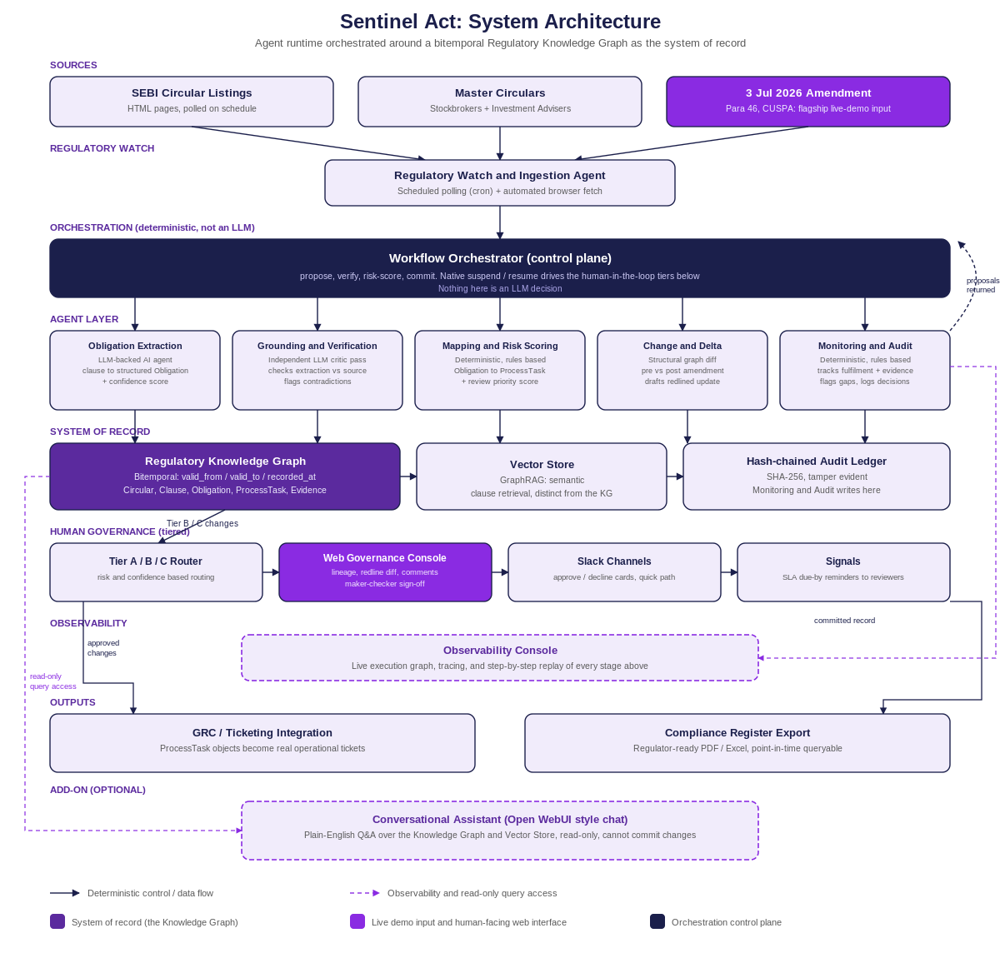

# Sentinel Act: Architecture and Schema Walkthrough

Team Gradera Sentinels, SEBI Securities Market TechSprint, GFF 2026

This document walks through the two core diagrams behind Sentinel Act: the system architecture (how the pipeline is put together) and the Regulatory Knowledge Graph schema (how the data is modeled). Read it alongside `Sentinel_Act_System_Architecture.png` and `Sentinel_Act_Knowledge_Graph_Schema.png` in the same folder.

---

## 1. System Architecture



The diagram is laid out as nine horizontal layers, top to bottom, in the order data actually moves. Solid navy arrows are deterministic control or data flow. Dashed purple arrows are observability and read-only query access, they never change graph state.

### Sources
Three inputs feed the pipeline: SEBI's circular listings (HTML pages, polled on a schedule), the two consolidated master circulars for Stockbrokers and Investment Advisers, and the flagship live-demo input, the 3 July 2026 amendment to Paragraph 46 on client unpaid securities (CUSPA auto-pledge). The amendment is highlighted in purple because it is what we feed the system live on stage.

### Regulatory Watch and Ingestion Agent
Polls the SEBI listings on a cron schedule and does the actual page fetch with an automated browser, since SEBI publishes circulars as HTML, not a public API. It detects anything not yet represented in the graph and cleans and chunks the new text before handing it to the Orchestrator.

### Orchestration (control plane)
The Workflow Orchestrator is a deterministic workflow, not an LLM. This is a deliberate design choice: the decision to commit a change to the graph is never made by model reasoning. The Orchestrator fans work out to the five agents below, and every agent only ever proposes a change; the Orchestrator is the single place that verifies, risk-scores, and commits. Its native suspend and resume mechanism is also the concrete implementation of the human-in-the-loop tiers further down the diagram; a suspended step is a change waiting on a human decision.

### Agent Layer
Five agents run in parallel under the Orchestrator:

1. **Obligation Extraction**, an LLM-backed agent, turns a clause into a structured Obligation with an initial confidence score.
2. **Grounding and Verification**, an independent LLM critic pass, checks that extraction against the literal source clause and flags contradictions before any human sees them.
3. **Mapping and Risk Scoring** is deliberately not an LLM call: deterministic, rules-based logic maps an Obligation to a ProcessTask and computes a review priority score from penalty severity, deadline proximity, and whether it touches a currently live obligation.
4. **Change and Delta** is the flagship differentiator: triggered by the Watch agent on a new or amended circular, it computes a structural graph diff between the pre- and post-amendment snapshot and drafts the redlined workflow update.
5. **Monitoring and Audit**, also deterministic, tracks fulfilment against each ProcessTask, ingests EvidenceArtifact records, flags gaps before deadlines, and logs every human reviewer decision. This is the agent that writes to the Hash-chained Audit Ledger in the System of Record row below.

All five report their proposals back to the Orchestrator (the dashed "proposals returned" arrow), which is what actually writes to the graph.

### System of Record
Three stores, only one of which is the graph:

- **Regulatory Knowledge Graph** (deep purple), the bitemporal system of record: every Circular, Clause, Obligation, ProcessTask, and EvidenceArtifact lives here, versioned with valid_from, valid_to, and recorded_at. This is Section 3 of this document.
- **Vector Store**, used for GraphRAG, semantic clause retrieval that expands beyond exact keyword matches. It is a retrieval aid that feeds grounded context to the Extraction and Verification agents. It is a different graph from the Knowledge Graph and does not replace it, though the two share the same underlying vector store for efficiency.
- **Hash-chained Audit Ledger**, SHA-256, tamper-evident. The Monitoring and Audit function writes every agent proposal and every human decision here, independent of the graph itself.

### Human Governance (tiered)
High-risk changes route through four components, left to right:

- **Tier A/B/C Router**, risk- and confidence-based routing that decides which of the three tiers a proposed change falls into.
- **Web Governance Console** (accent purple), the reviewer's primary screen: source clause beside the extracted Obligation, the redlined ProcessTask diff, full lineage, and the maker-checker sign-off flow with a required rationale field.
- **Slack Channels**, a quick path alongside the console: interactive approve/decline cards for reviewers who do not need the full lineage view.
- **Signals**, which push an SLA due-by reminder into a reviewer's queue as their deadline approaches.

### Observability Console
A dashed-border box because it observes rather than acts: it renders the live execution graph of the workflow and lets a viewer replay any single step, useful both for demo narration and for post-hoc debugging.

### Outputs
Approved changes flow to **GRC / Ticketing Integration**, where ProcessTask objects become real operational tickets, and to **Compliance Register Export**, a regulator-ready PDF or Excel export that is queryable point-in-time, not just a snapshot.

### Add-on (optional): Conversational Assistant
A dashed box, deliberately styled like the Observability Console to signal that it is also read-only. An Open WebUI style chat interface sits alongside the pipeline so a Compliance Officer can ask a plain English question, such as which obligations changed for stockbrokers this month, and get an answer grounded with citations back to the graph. It cannot approve, reject, or commit anything; every governed decision still runs through the Web Governance Console or Slack under the Tier A/B/C policy.

### Walking a single change through the whole diagram
Trace the 3 July 2026 amendment end to end: it enters as a Source, the Watch agent detects it and hands it to the Orchestrator, which fans it out to Extraction (produces a candidate Obligation), Verification (checks it against the literal clause), Mapping and Risk Scoring (turns it into a ProcessTask and scores it), and Change and Delta (diffs it against the Obligation it supersedes). All four proposals return to the Orchestrator, which writes the interim state to the Knowledge Graph, Vector Store, and Audit Ledger, then, because this is a penalty-bearing change to a currently live obligation, routes it to Tier C in the Web Governance Console for maker-checker sign-off. Once both reviewers approve, the Orchestrator commits the change, Monitoring and Audit logs both HumanReview decisions and confirms the ProcessTask's evidence requirements against the ledger, the Observability Console shows the whole run, and the result lands in both GRC/Ticketing and the Compliance Register Export. A Compliance Officer could also just ask the Conversational Assistant what changed, at any point, without touching the governed path.

---

## 2. Regulatory Knowledge Graph Schema (v1.1, production schema)


This is the entity-relationship schema behind the "System of Record" box above. It is a bitemporal property graph: every node and every edge carries `valid_from`, `valid_to`, and `recorded_at`, so the graph can answer both "what does the regulation require" and "what did our system know, and when."

### Node types

| Node | Primary key | Key fields | Role |
|---|---|---|---|
| Circular | circular_id | title, type, category, date_issued, date_effective, source_hash; FK supersedes_circular_id | Anchors every downstream fact to a specific, dated regulatory instrument |
| Clause | clause_id | para_ref, text, embedding_ref; FK circular_id | Smallest unit of regulatory text, the exact wording a judge or auditor can check against |
| Obligation | obligation_id | category, requirement_text, trigger_event, deadline_rule, responsible_role, evidence_required, penalty_ref, confidence_score, grounding_score, status; FK derived_from_clause_id | The atomic, machine-actionable rule extracted from a clause, and the hub of the graph |
| ProcessTask | task_id | task_name, owner_role, sla_hours, system_touchpoint, risk_score; FK obligation_id | The operational instruction a real compliance team executes |
| EvidenceArtifact | evidence_id | type, hash, uploaded_at, uploaded_by; FK task_id | Proof of fulfilment, hash-chained for tamper evidence |
| IntermediaryCategory | category_id | name | Lets one graph serve stockbrokers, investment advisers, and future categories with no schema change |
| HumanReview | review_id | reviewer_id, tier, decision, rationale, decided_at; FK obligation_id | The auditable fact of a Tier B/C human decision, who approved what and on what basis |

### Edge types

| Relationship | Connects (cardinality) | What it enables |
|---|---|---|
| SUPERSEDES | Circular to Circular (0..1:0..1); Obligation to Obligation (0..1:0..1) | Full regulatory lineage: which rule replaced which, and exactly when |
| PART_OF | Clause to Circular (N:1) | Traceability back to the exact source document |
| DERIVED_FROM | Obligation to Clause (N:1) | Every obligation cites its precise origin, not a paraphrase |
| APPLIES_TO | Obligation to IntermediaryCategory (N:N) | One obligation can serve multiple categories where SEBI's language overlaps |
| MAPPED_TO | Obligation to ProcessTask (1:N) | The bridge from regulatory intent to operational execution |
| EVIDENCED_BY | ProcessTask to EvidenceArtifact (1:N) | Closes the loop from action back to auditable proof |
| REVIEWED_BY | Obligation to HumanReview (1:N) | Links a proposed change to every reviewer decision made on it; a Tier C item carries two |

### Bitemporal versioning

Every node and edge carries two independent time axes. Valid time (`valid_from`, `valid_to`) is the regulatory effective window, taken from the circular's own effective date and any supersession; it answers "what did the regulation require on date X." Transaction time (`recorded_at`) is when Sentinel Act's pipeline ingested and asserted that fact; it answers "what did our system know, and how fast did it know it," which is exactly the regulatory-issuance-to-operational-action lag the problem statement asks us to close. Example point-in-time query:

```
MATCH (o:Obligation)-[:APPLIES_TO]->(:IntermediaryCategory {name: "Stockbroker"})
WHERE o.valid_from <= date("2026-07-05")
  AND (o.valid_to IS NULL OR o.valid_to > date("2026-07-05"))
RETURN o
```

This same query pattern backs the compliance register export and is what makes the Change and Delta agent reliable: a new circular closes the `valid_to` window on the obligations it supersedes and opens new ones, so the "delta" is a structural graph diff between two dated snapshots, not a best-effort LLM comparison.

### Production hardening notes

- **Keys.** Every identifier is a v4 UUID and a primary key. Every field named "FK" in the table above is a foreign key to another node's primary key.
- **Cardinality.** 1 means exactly one, N means many, 0..1 means optional. APPLIES_TO is the only many-to-many edge; every other structural edge is many-to-one or one-to-many.
- **Indexing.** Every node label and edge label carries a composite index on (`valid_from`, `valid_to`), plus a b-tree index on `recorded_at`, so the point-in-time query above is an index lookup, not a full scan, even as the graph grows across years of circulars.
- **Tamper evidence.** `Circular.source_hash` and `EvidenceArtifact.hash` are SHA-256 and feed the same hash-chained ledger used for the compliance register export.
- **Model-agnostic ingestion.** `Obligation.confidence_score` and `Obligation.grounding_score` are written by an LLM-backed extraction and verification layer that is swapped in through Mastra's model router. No single LLM vendor is coupled to the schema.

---

## 3. How the two diagrams connect

Each agent in the architecture diagram maps to a specific write in the schema: the Watch agent proposes Circular and Clause nodes and PART_OF/SUPERSEDES edges; Obligation Extraction proposes Obligation nodes and DERIVED_FROM/APPLIES_TO edges; Mapping and Risk Scoring proposes ProcessTask nodes and MAPPED_TO edges; Change and Delta closes `valid_to` windows and proposes new SUPERSEDES edges; Monitoring and Audit proposes EvidenceArtifact nodes and EVIDENCED_BY edges, and is also the agent that actually writes the HumanReview node once a reviewer decides. The Web Governance Console is where that reviewer decision is captured, via the REVIEWED_BY edge back to the Obligation it decided on, which is also what makes "who approved this, and on what basis" answerable by a graph query rather than a memory. The Conversational Assistant and the Vector Store both sit outside this write path entirely, they read the graph, they never write to it.
